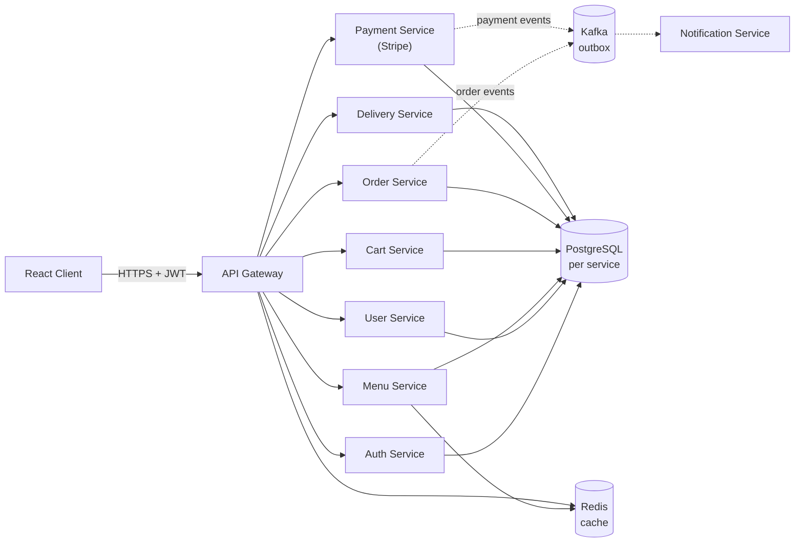
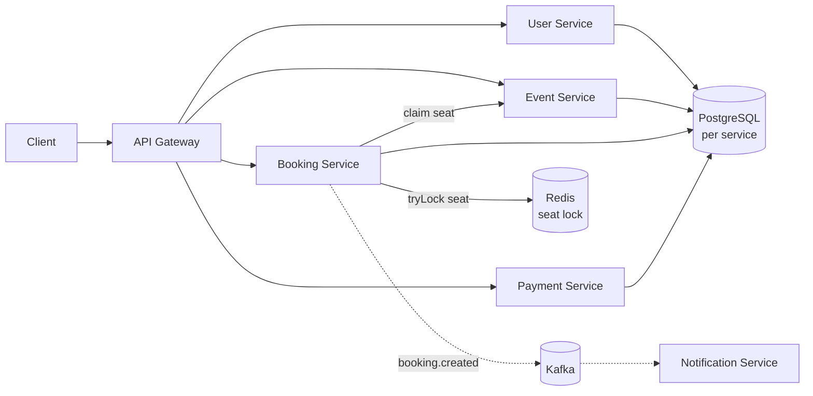
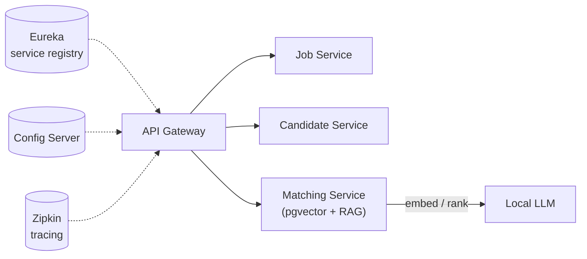
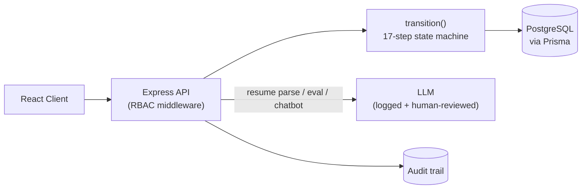
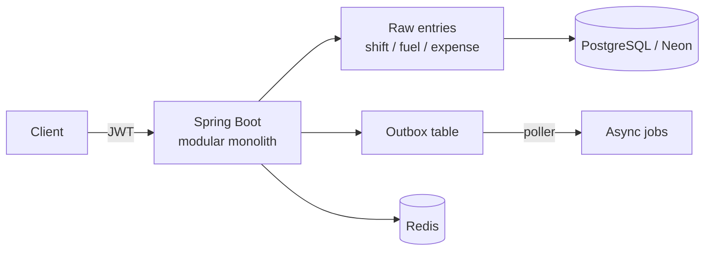

<div align="center">

<a href="https://portfolio-eta-one-1hhe8hokhj.vercel.app/">
  
</a>

<br><br>

[](https://portfolio-eta-one-1hhe8hokhj.vercel.app/)
[](https://www.linkedin.com/in/anushchinnasamy)
[](https://leetcode.com/u/anushchinnasamy/)
[](mailto:anushchinnasamy@gmail.com)

</div>

<br>

## About

I build distributed backend systems in Java and Spring Boot — services that talk to each other over Kafka, own their own databases, and stay correct under concurrent load — and ship GenAI features (RAG, LLM tool-calling) on top of them.

<br>

## Tech Stack

<table>
<tr>
<td valign="top" width="50%">

**Core Backend**
```
Java 17 · Spring Boot · FastAPI
REST APIs · SQL · Microservices
```

**Databases**
```
PostgreSQL · Neon · Cassandra
Redis · pgvector
```

**Messaging / Real-time**
```
Kafka · WebSocket · WebRTC
Redis Pub/Sub
```

</td>
<td valign="top" width="50%">

**Resilience**
```
Redisson · SAGA · Idempotency Keys
Resilience4j · Caching
```

**GenAI**
```
RAG · Vector Embeddings
LLM Integration · Prompt Engineering
AI Agents / Function Calling
```

**Cloud / DevOps**
```
Azure (AZ-900, AZ-204) · Docker
GitHub Actions · Harness CI/CD
Render · Vercel
```

</td>
</tr>
</table>

<br>

## Selected Projects

<table>
<tr>
<td width="50%" valign="top">

### 01 · Ticket Booking System — `Backend`
Distributed ticketing platform: Redis + Redisson distributed locking, Kafka, Resilience4j circuit breakers, JWT, ZXing/PDFBox tickets. 5 Spring Boot microservices.

**Result:** flash-sale load test at 300,998 requests / 5,000 req/sec across 50 seats, zero overselling. Chaos test confirms the circuit breaker opens correctly under failure.

`Java` `Spring Boot` `Redis` `Redisson` `Kafka` `Resilience4j` `JWT`

[`Anushchinnasamy/ticket-booking-system`](https://github.com/Anushchinnasamy/ticket-booking-system)

</td>
<td width="50%" valign="top">

### 02 · Spicyeat — `Backend`
9 Spring Boot microservices (gateway, auth, user, menu, cart, order, payment, delivery, notifications), database-per-service PostgreSQL with Flyway, Redis caching and gateway rate limiting, Kafka transactional outbox for order/payment events, Stripe payments. React + TypeScript + Vite frontend on Vercel.

**Result:** strict database-per-service ownership; order/payment events survive service crashes without distributed transactions.

`Spring Boot` `Kafka` `Redis` `PostgreSQL` `Stripe` `React` `TypeScript`

[`Anushchinnasamy/SpicyEat`](https://github.com/Anushchinnasamy/SpicyEat)

</td>
</tr>
<tr>
<td width="50%" valign="top">

### 03 · RecruitFlow AI — `GenAI`
8 Spring Boot microservices, RAG pipeline over local LLMs with vector embeddings, pgvector, full Spring Cloud stack (Eureka, Config Server, Gateway, Zipkin, Resilience4j), JWT auth.

**Result:** RAG-based resume-to-role matching backed by a complete Spring Cloud microservice stack.

`Spring Boot` `RAG` `LLM` `pgvector` `Eureka` `Zipkin`

[`Anushchinnasamy/RecruitFlowAI`](https://github.com/Anushchinnasamy/RecruitFlowAI)

</td>
<td width="50%" valign="top">

### 04 · Baaki (TripMeter) — `Backend`
Earnings-truth API for Indian gig riders — real take-home after fuel/EMI/insurance. Modular monolith, Spring Boot, PostgreSQL/Neon, Redis, transactional outbox pattern.

**Result:** deliberate modular-monolith architecture with an outbox pattern for reliable event delivery, sized right for a single-owner project.

`Spring Boot` `PostgreSQL` `Neon` `Redis` `Outbox Pattern`

[`Anushchinnasamy/TripMeterBackend`](https://github.com/Anushchinnasamy/TripMeterBackend)

</td>
</tr>
<tr>
<td width="50%" valign="top">

### 05 · InternFlow AI — `Backend`
17-step state machine for the unpaid-internship lifecycle, Node.js/Express/TypeScript/Prisma/PostgreSQL, LLM-powered, 9 AI-assisted actions, NDA hard gate, full audit trail.

**Result:** every AI action is advisory, logged, and human-reviewable — never autonomous.

`Node.js` `Express` `TypeScript` `Prisma` `PostgreSQL` `LLM`

[`Anushchinnasamy/InternFlow-AI`](https://github.com/Anushchinnasamy/InternFlow-AI) · [`Frontend`](https://github.com/Anushchinnasamy/InternFlow-AI-Frontend)

</td>
</tr>
</table>

<br>

## Architecture Showcase

**Spicyeat** — gateway-fronted microservices, database-per-service, Kafka outbox for order/payment events:



**Ticket Booking System** — distributed locking guards a hot 50-seat show against a flash-sale crowd:



**RecruitFlow AI** — RAG-based candidate ranking behind a full Spring Cloud stack:



**InternFlow AI** — a single state machine gates every lifecycle transition; AI actions are advisory, not autonomous:



**Baaki (TripMeter)** — modular monolith; a transactional outbox stands in for a message broker:



<br>

## Services

```
Backend System Architecture
Microservices Development
Database Design & Optimization
AI Integration & RAG Systems
Performance Tuning & Scaling
```

<br>

## Contact

<div align="center">

[Portfolio](https://portfolio-eta-one-1hhe8hokhj.vercel.app/) &nbsp;·&nbsp; [LinkedIn](https://www.linkedin.com/in/anushchinnasamy) &nbsp;·&nbsp; [LeetCode](https://leetcode.com/u/anushchinnasamy/) &nbsp;·&nbsp; [anushchinnasamy@gmail.com](mailto:anushchinnasamy@gmail.com)

</div>
