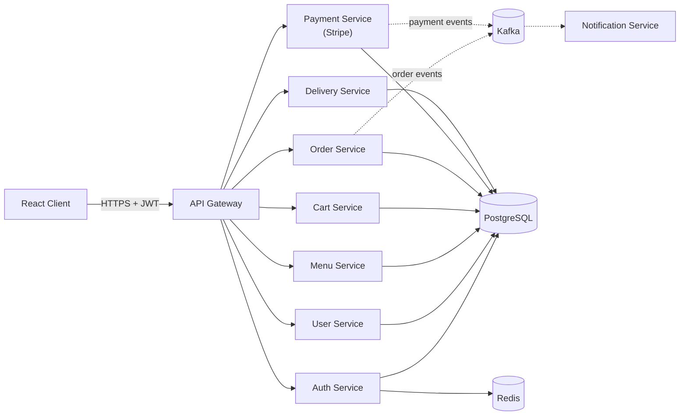
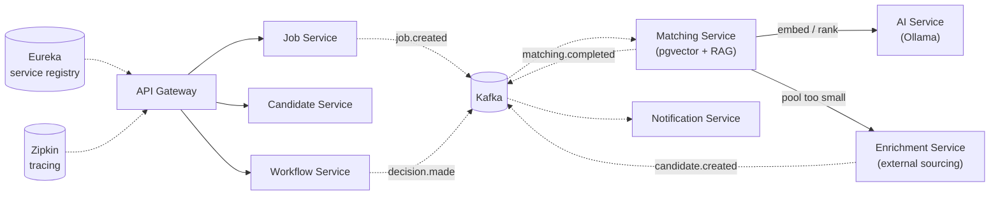
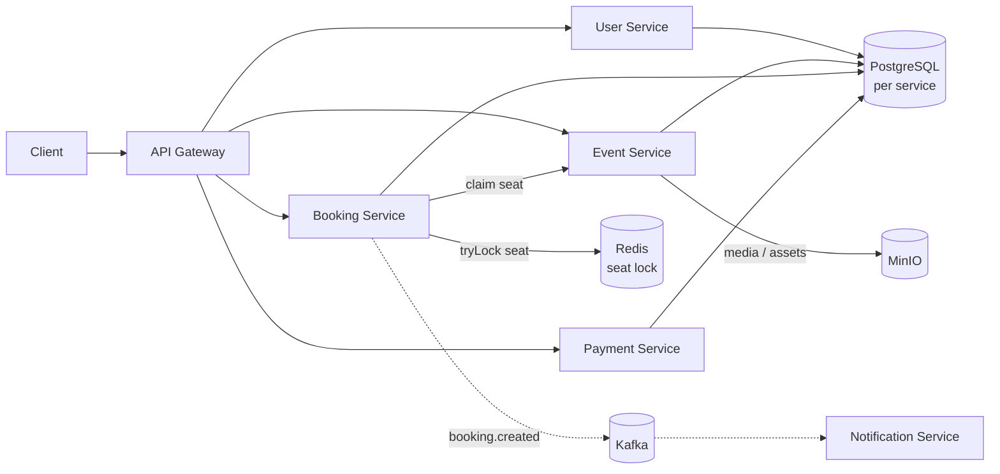
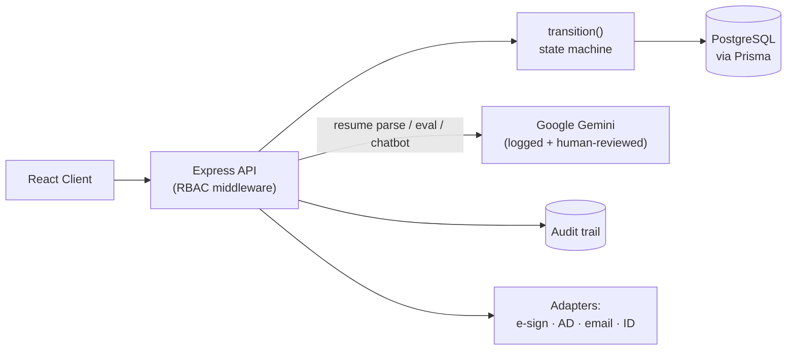
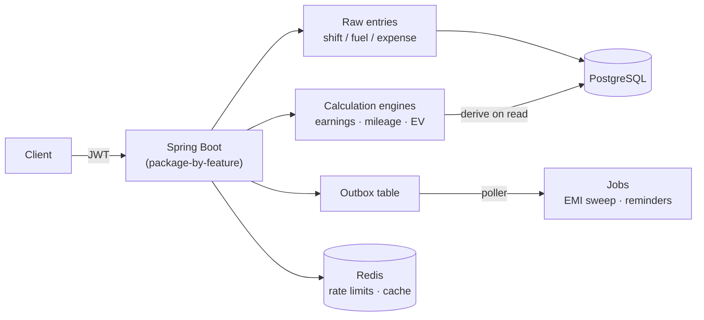

<div align="center">

# Anush Chinnasamy

**Java Backend Engineer&nbsp;·&nbsp;GenAI Engineer**

Building distributed backend systems — microservices, event-driven pipelines, and real-time infrastructure — and shipping GenAI features (RAG, LLM tool-calling) on top of them.

`Java` `Spring Boot` `Spring Cloud` `Kafka` `PostgreSQL` `Redis` `Docker` `RAG / LLMs`

[](https://www.linkedin.com/in/anushchinnasamy)
[](https://github.com/Anushchinnasamy)
[](mailto:anushchinnasamy@gmail.com)

</div>

<br>

## About

I build production-shaped backend systems in Java and Spring Boot — services that talk to each other over Kafka, discover each other through Eureka, share config through a Config Server, and stay observable through tracing and health checks, not just services that compile.

Recent focus:

- **Distributed systems** — service discovery, centralized config, API gateways, event-driven communication, distributed locking under contention
- **System design under load** — flash-sale traffic patterns, race conditions, concurrency-safe reservations, load/chaos testing as part of the build, not an afterthought
- **Generative AI** — RAG pipelines over vector search, LLM-based ranking and extraction, both hosted (Gemini) and local (Ollama) models
- **Full-stack delivery** — React/TypeScript frontends wired to the same backends, so the systems above ship as usable products, not just APIs

<br>

## Tech Stack

<table>
<tr>
<td valign="top" width="50%">

**Backend**
```
Java · Spring Boot · Spring Cloud
Spring Security · REST APIs
Microservices · Node.js / Express
```

**Data**
```
PostgreSQL · Redis · pgvector
Prisma
```

**Messaging & Infrastructure**
```
Apache Kafka · Docker · Podman
Eureka · Spring Cloud Config
Zipkin (distributed tracing)
```

</td>
<td valign="top" width="50%">

**GenAI**
```
LLM Tool-Calling · RAG
Embeddings · Vector Search
Google Gemini · Ollama (local LLMs)
```

**Frontend**
```
React · TypeScript · Vite
HTML · CSS · TanStack Query
```

**Tooling**
```
Maven · Git · Postman / Newman
k6 (load testing) · GitHub Actions
```

</td>
</tr>
</table>

<br>

## Featured Projects

<table>
<tr>
<td width="50%" valign="top">

### SpicyEat
Single-brand food ordering platform — production-shaped, not a toy CRUD app.

**Stack:** Spring Boot · API Gateway · PostgreSQL · Redis · Kafka · Stripe · React/TS

**Engineering:** 8 independently-deployed microservices (auth, user, menu, cart, order, payment, delivery, notification) behind a single gateway; event-driven order/payment flow over Kafka; JWT auth at the edge

[`Anushchinnasamy/SpicyEat`](https://github.com/Anushchinnasamy/SpicyEat)

</td>
<td width="50%" valign="top">

### Ticket
Distributed, BookMyShow-style event ticket booking backend, built and load-tested for flash-sale traffic.

**Stack:** Spring Boot · Kafka · PostgreSQL · Redis · MinIO · k6

**Engineering:** Redis-backed distributed locking for seat reservation — verified **zero overselling across 300K+ requests at 5,000 req/s**; automated chaos testing

[`Anushchinnasamy/ticket-booking-system`](https://github.com/Anushchinnasamy/ticket-booking-system)

</td>
</tr>
<tr>
<td width="50%" valign="top">

### RecruitFlow AI
AI-powered recruitment platform — candidates are ranked against job descriptions with RAG, not keyword matching.

**Stack:** Spring Boot microservices · Kafka · Ollama · pgvector · Eureka · Config Server · Zipkin · Resilience4j

**Engineering:** RAG-based candidate ranking; saga-orchestrated enrichment (sources external candidates when the internal pool is too thin, with timeout-based forward recovery); full service discovery + centralized config + distributed tracing

[`Anushchinnasamy/RecruitFlowAI`](https://github.com/Anushchinnasamy/RecruitFlowAI)

</td>
<td width="50%" valign="top">

### InternFlow AI
Backend + frontend for the full unpaid-internship lifecycle — referral through closure and certificate — with AI assistance built in as an advisory layer.

**Stack:** Node.js · Express · TypeScript · Prisma · PostgreSQL · Google Gemini API · React/Vite

**Engineering:** 17-state lifecycle machine enforced through a single `transition()` gate; server-side RBAC across 9 roles; full audit trail; AI-assisted resume parsing, evaluation, and an internal chatbot — every AI action is logged and human-reviewable, never autonomous

[`Anushchinnasamy/InternFlow-AI`](https://github.com/Anushchinnasamy/InternFlow-AI) · [`Frontend`](https://github.com/Anushchinnasamy/InternFlow-AI-Frontend)

</td>
</tr>
<tr>
<td width="50%" valign="top">

### Trip Meter
Earnings-truth API for Indian gig-economy riders — computes what a rider actually keeps after fuel, maintenance, EMI, and insurance, per day/hour/km.

**Stack:** Spring Boot · PostgreSQL · Redis · JWT

**Engineering:** Modular monolith, package-by-feature (not microservices by default); transactional-outbox pattern for async follow-up work instead of a message broker; derive-on-read calculation engines over immutable raw entries

[`Anushchinnasamy/TripMeterBackend`](https://github.com/Anushchinnasamy/TripMeterBackend)

</td>
</tr>
</table>

<br>

## Engineering Highlights

| | | |
|---|---|---|
| Microservices | Event-Driven Architecture | Distributed Systems |
| REST API Design | Service Discovery (Eureka) | Centralized Config |
| Distributed Locking | Rate Limiting | Caching |
| Database Design | Distributed Tracing | Load & Chaos Testing |
| RAG | LLM Tool-Calling | Vector Search |

<br>

## Architecture Showcase

**SpicyEat** — gateway-fronted microservices, one Postgres/Redis/Kafka backbone per environment:



**RecruitFlow AI** — event-driven candidate matching with a saga-orchestrated enrichment fallback:



**Ticket** — distributed locking guards a hot 50-seat show against a flash-sale crowd:



**InternFlow AI** — a single state machine gates every lifecycle transition; AI actions are advisory, not autonomous:



**Trip Meter** — modular monolith; a transactional outbox stands in for a message broker:



<br>

## GitHub Activity

<div align="center">


</div>

<br>

## Contact

<div align="center">

[LinkedIn](https://www.linkedin.com/in/anushchinnasamy) &nbsp;·&nbsp; [anushchinnasamy@gmail.com](mailto:anushchinnasamy@gmail.com) &nbsp;·&nbsp; [GitHub](https://github.com/Anushchinnasamy)

</div>
